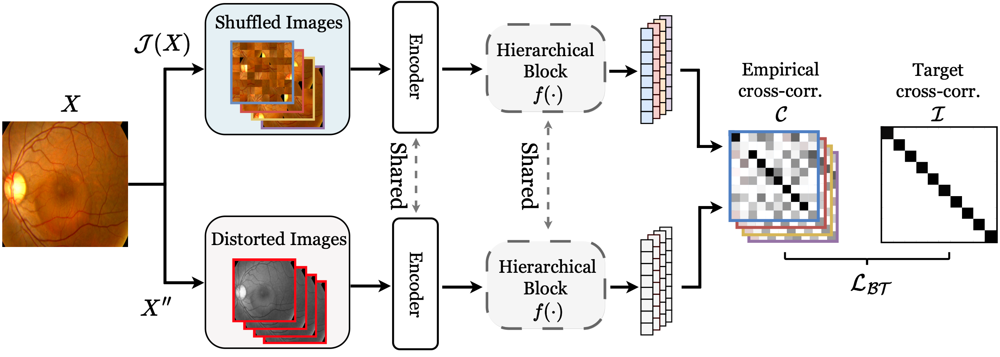

# Fine-Grained Self-Supervised Learning with Jigsaw Puzzles for Medical Image Classification

This is an official implementation of the paper,
> Fine-Grained Self-Supervised Learning with Jigsaw Puzzles for Medical Image Classification<br/>
> [Wongi Park](https://www.linkedin.com/in/wongipark/), [Jongbin Ryu](https://sites.google.com/view/jongbinryu/about-me?authuser=0).<br/>
> (Comming soon..), <br/>


## Environment Setting
- **Conda environment**
: Ubuntu 18.04 CUDA-10.1 (10.2) with Pytorch==1.13.0, Torchvision==0.6.0 (python 3.8).<br/>

```
# Create Environment
conda create -n fgssl python=3.8
conda activate fgssl

# Install pytorch, torchvision, cudatoolkit
conda install pytorch==1.13.0 torchvision==0.6.0 cudatoolkit=10.1 (10.2) -c pytorch
```

## Overall Framework


<a id="dataset"></a>
## Benchmark Dataset

- **How to get dataset?**

1. APTOS 2019 Blindness : [APTOS2019](https://www.kaggle.com/c/aptos2019-blindness-detection)
2. ISIC2018 Challenge :  [ISIC2018](https://challenge.isic-archive.com/)
3. ISIC2018 Challenge :  [ISIC2017](https://challenge.isic-archive.com/)

- **Directory structure of our project**
```
- Directory
  - run.sh                : shell Script Version (pretraining, training, inference)
  - main.py               : Main Execution (Args, Setting)
  - dataset               : Augmentation, DataLoader
      - ...
  - learner               : training, inference 
      - ...
  - utils                 : Metrics, Jigsaw Setting (Metric, jigsaw Patch Setting)
      - ...
```

## Supporting papers

(1) Jigsaw patch  ([Paper](https://arxiv.org/abs/1603.09246) / [Code](https://github.com/bbrattoli/JigsawPuzzlePytorch))

(2) BarlowTwins  ([Paper](https://arxiv.org/abs/2103.03230) / [Code](https://github.com/facebookresearch/barlowtwins))

(3) progressive Learning  ([Paper](https://arxiv.org/pdf/2003.03836v3.pdf) / [Code](https://github.com/kalelpark/Latest_Progressive-Multi-Granularity-Training-of-Jigsaw-Patches#papers-and-projects))


## Training & Inference
```
python main.py --seed 0 --model pmg --patches 32 16 8 --dataset aptos --gpu_ids [gpu_idx]
```

The results will be automatically saved in ./workspace/[model name]/[Workspace Name].


## How to cite
```
@article = {
    title = {Learning a Mixture of Granularity-Specific Experts for Fine-Grained Categorization},
    author = {Wongi Park},
    journal = {GitHub},
    url = {https://github.com/kalelpark/FG-SSL},
    year = {2022},
}
```